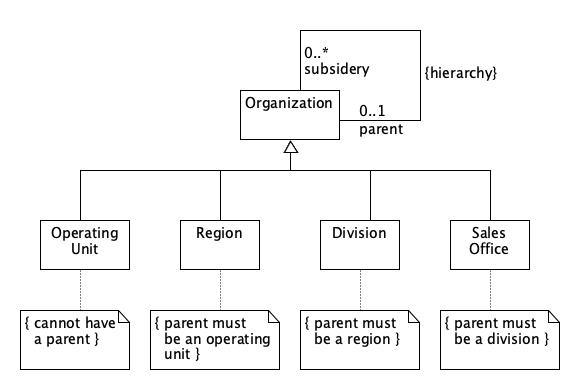
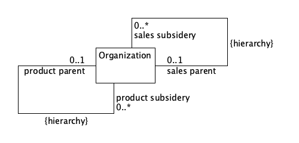
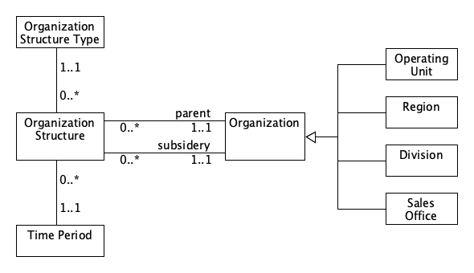
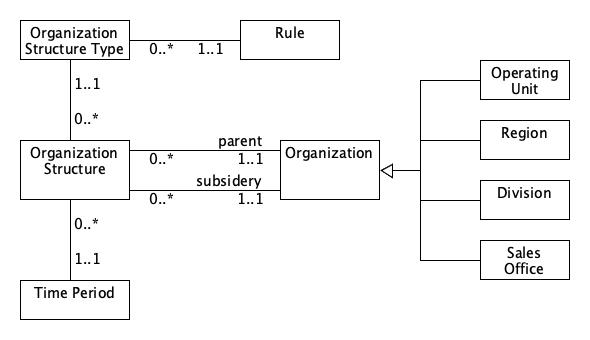
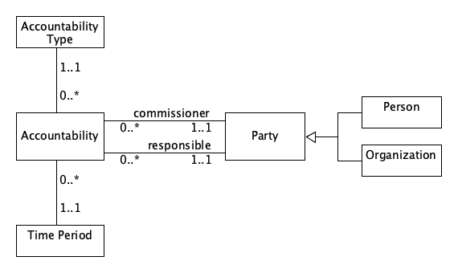
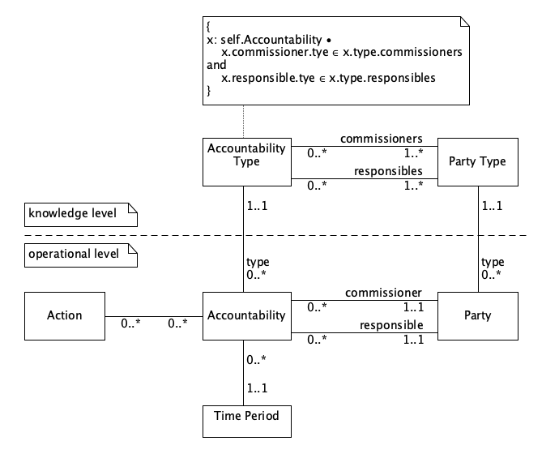

[TOC](../README.md) | [English] [[中文]](c02_cn.md)

# Chapter 2 Accountability
 

## 2.1 Party

* **Problem**: People and organizational units have similar responsibilities.  
* **Solution**: Create a type party as a supertype of person and organization.  

 

  
Figure 2.1 Initial model of an address book.  
*This model shows the similar responsibilities of person and organization.*  

 
 

  
Figure 2.2 Figure 2.1 generalized using party.  
*Party should be used in many situations where person or organization is used.*   

 

## 2.2 Organization Hierarchies

* **Problem**: Representing a hierarchical organization structure.
* **Solution**: Create a recursive association on organization.

 

  
Figure 2.3 Ogranization structure with explicit levels.  
*Such structure is inflexible and not reuseable.*  

 
 

  
Figure 2.4 Organization supertype with hierarchic relationship.  
*The hierarchic association provides the most flexibility. Constraints due to levels have to be added as rules on the subtypes.*  

 
 

  
Figure 2.5 Two organizational hierarchies.  
*Subtypes of the organization are not shown. If there are many hierarchies, this will soon get out of hand.*  

 

## 2.3 Organization Structure 36

* **Problem**: 
  * An organization structure has hierarchies or more complex links.
  * New kinds of links appearing. Keeping a history of changes to the structure.
* **Solution**: Create organization structure as a directed relationship between two parties. Give it an organization structure type to represent the kind of relationship.

 

  
Figure 2.6 Using a typed relationship.  
*Each relationship between organizations is defined by an organization structure type. It is better than explicit associations if there are many relationships.*

 

## 2.4 Accountability

* **Problem**: Representing organization structures, employment, management, professional registration, and contracts with a similar structure.
* **Solution**: Create accountability as a directed relationship between two parties. Give it an accountability type to represent the kind of relationship.

 

  
Figure 2.7 Adding a rule to Figure 2.6.  
*The rule enforces constraints such as sales offices reporting to divisions.*

 
 

  
Figure 2.8 Accountability.  
*Using a party allows accountability to cover a wide range of interparty responsibilities, including management, employment, and contracts.*

 

## 2.5 Accountability Knowledge Level

* **Problem**: Recording the rules that describe how accountabilities can be formed in a way that is easy to change.
* **Solution**: Create a knowledge level for accountability by associations between accountability type and party type. This knowledge level constrains the operational level of accountability and party.

 

  
Figure 2.9 Knowledge and operational levels of accountability.
*The knowledge level objects define the legal configurations of operational level objects. Accountabilities can only be created between parties according to corresponding accountability types and party types.*

 

## 2.6 Party Type Generalizations

* **Problem**: Of many party types in a model, most are similar to some other party type.
* **Solution**: Allow party types to be subtyped so they inherit accountability types.

## 2.7 Hierarchic Accountability

* **Problem**: Constraining some accountability types into a hierarchy.
* **Solution**: Define a subtype of accountability type that includes the hierarchy constraint. A list of levels allows you to name each level in the hierarchy.

## 2.8 Operating Scope

* **Problem**: Describing what responsibilities are implied by an accountability.
* **Solution**: Add a number of operating scopes to the accountability. The type of
operating scope depends on the type of accountability.

## 2.9 Post

* **Problem**: Accountabilities are due to the job rather than the person doing it.
* **Solution**: Create a post as another subtype of party. Appoint a person to a post with an accountability. The holder of the post then gets the responsibilities of the post while they hold it.