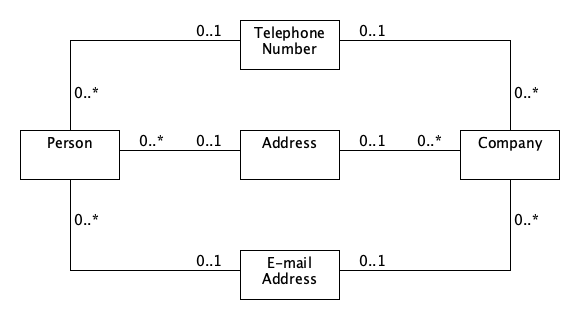
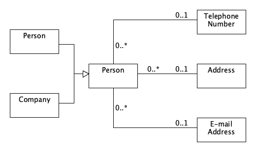
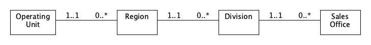

# Chapter 2 Accountability

## 2.1 Party

* **Problem**: People and organizational units have similar responsibilities.

* **Solution**: Create a type party as a supertype of person and organization.
  
  

  
Figure 2.1 Initial model of an address book.  
*This model shows the similar responsibilities of person and organization.*

  
Figure 2.2 Figure 2.1 generalized using party.  
*Party should be used in many situations where person or organization is used.* 

## 2.2 Organization Hierarchies

* **Problem**: Representing a hierarchical organization structure.
* **Solution**: Create a recursive association on organization.

  
Figure 2.3 Ogranization structure with explicit levels.  
*Such structure is inflexible and not reuseable.*

  
Figure 2.4 Organization supertype with hierarchic relationship.  
*The hierarchic association provides the most flexibility. Constraints due to levels have to be added as rules on the subtypes.*

  
Figure 2.5 Two organizational hierarchies.  
*Subtypes of the organization are not shown. If there are many hierarchies, this will soon get out of hand.*